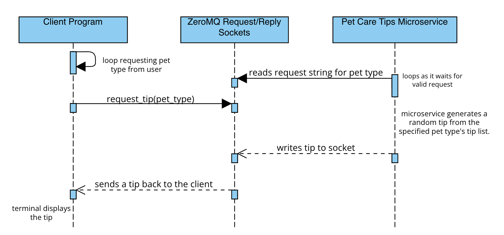

# Pet-Care-Tips
5/9/24
Pet Care Tips: a microservice that generates pet care tips

**Communication Contract**

**How to Request Data from the Microservice and Example Call:**  
In order to request a random pet care tip from the microservice, please have the user input a pet type (either 'cat' or 'dog'). This pet type will then be used as an argument in the function request_tip(pet_type) which will send the request. Please refer to client.py which provides an example client code that you may use.

Here's an example call:

request_tip("dog")

**How to Receive Data from the Microservice:**  
In order to receive data from the microservice, you need
to have a server that is running and listening to the request. Here, I've used ZeroMQ. The client inputs the string request, and the server listens for a string request that's either 'cat' or 'dog'. Then, it will send back a random tip based on the pet type received. Please refer to server.py for the code.

Here is how to use the client.py and server.py code provided.

1. Download both files.
2. Open the files on your preferred IDE. I used VScode and my instructions will be based on VSCode.
3. On VSCode, open up two terminals.
4. Start the server code first. On the first terminal, enter the following command: 
python3 server.py
5. Then, on the second terminal, enter the following command to start the client code:
python3 client.py
6. Request for a pet care tip on the client terminal. 

UML Diagram:

Sources Used: 
https://www.aspca.org/pet-care/cat-care/general-cat-care
https://www.aspca.org/pet-care/dog-care/general-dog-care
https://zeromq.org/languages/python/

